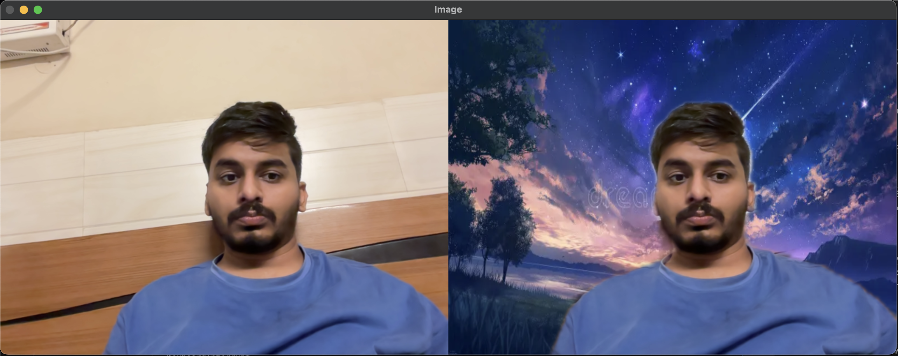

# Virtual Background

A real-time virtual background application using your webcam.

## Requirements

- `opencv-python`
- `numpy`
- `cvzone`
- `mediapipe`

Install dependencies:

```bash
pip install -r requirements.txt
```

## Usage

1. Add background images to the `images` folder.
2. Run the script:
   ```bash
   python main.py
   ```
3. Use 'a' and 'd' to cycle through backgrounds, and 'q' to quit.

## Customizing Background Images

To use your own backgrounds, simply add or replace image files in the `images` folder. Supported formats include PNG and JPG. The app will automatically load all images in that folder and let you cycle through them with the 'a' and 'd' keys while running.

## Sample Output

Sample output:


